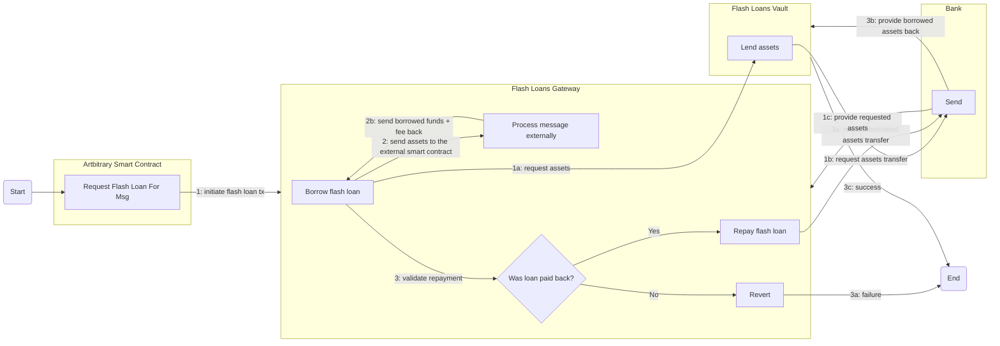

```mermaid
flowchart LR
    Start(Start)

    End(End)

    subgraph ASC [Artbitrary Smart Contract]
        ASCReqFL4Msg[Request Flash Loan For Msg]
    end

    Start --> ASCReqFL4Msg

    subgraph FLG [Flash Loans Gateway]
        FLGBorrow[Borrow flash loan]

        FLGProcess[Process message externally]

        FLGPostValidate{Was loan paid back?}

        FLGRepay[Repay flash loan]

        FLGRevert[Revert]
    end

    subgraph FLV [Flash Loans Vault]
        FLVLend[Lend assets]
    end

    subgraph Bank
       BankSend[Send]
    end

    ASCReqFL4Msg -->|1: initiate flash loan tx| FLG

    FLGBorrow -->|1a: request assets| FLVLend
    FLVLend -->|1b: request assets transfer| BankSend
    BankSend --->|1c: provide requested assets| FLG

    FLGBorrow -->|2: send assets to the external smart contract| FLGProcess
    FLGProcess -->|2b: send borrowed funds + fee back| FLGBorrow

    FLGBorrow -->|3: validate repayment| FLGPostValidate
    FLGPostValidate -->|Yes| FLGRepay
    FLGPostValidate -->|No| FLGRevert
    FLGRevert -->|3a: failure| End

    FLGRepay -->|3a: request borrowed assets transfer| BankSend
    BankSend -->|3b: provide borrowed assets back| FLV
    FLV -->|3c: success| End
```